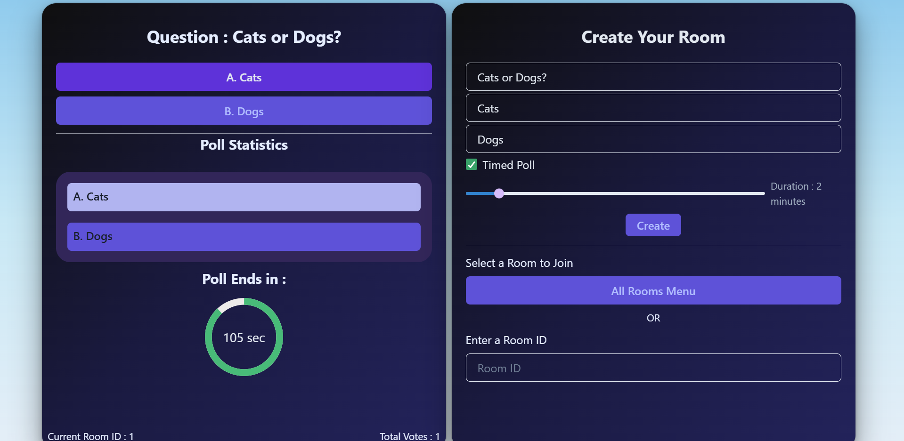

# Real-Time Voting App

A minimal real-time voting app built with **React**, **Chakra UI**, **Node.js**, and **WebSocket**. This app allows users to create voting rooms, vote in real-time, and see live updates of results — all without a database. Everything runs in-memory.

**Note:-** Since the Backend of this project is deployed on Render, you might have to wait for some time to get a response from the server while using the deployed link of the frontend.

---



## Features

- Create a room with a question and two voting options
- Enter any Room by selecting any available poll from a dropdown menu, or join a room by entering its unique ID
- Cast a vote (Option A or B)
- Real-time vote updates for all connected users
- Client-side restriction: vote only once per room
- Decide the Time limit for the poll you create and watch it getting updated in Real-Time

---

## Tech-Stack

**Frontend:**

- React
- Chakra UI
- WebSocket API

**Backend:**

- Node.js
- ws (WebSocket library)

---

## Setup Instructions

The Project folder is split up into two subfolders, namely client (Frontend) and server (Backend).
To run the project locally, install the zip file of this repo on your desktop. Then follow the steps below.

```bash
git clone https://github.com/AadityanshuSingh/realtime-voting-app.git
cd client/realtime-voting-app
```

**Install Dependencies(Frontend)**
cd client/vote-app-frontend
npm install
npm run dev

**Install Dependencies(Backend)**
cd server
npm install
npm start

## Brief on Vote-state sharing and Room Management

The State of the Room in the Backend is managed by maintaining an array of objects (rooms). Each object represents a room and has the following properties

1. id: for uniqueness, in this case, the id is the index of the object in the rooms array
2. question: The question set by the client
3. optA: A string containing option A
4. optB: A string containing option B
5. isTimeOut: To check whether this poll has a time limit
6. duration: If it is a timed poll, then this prop stores the duration of the poll in minutes
7. endTime: It is calculated by adding the duration to the the time of creation of poll
8. countA: Votes in A (default 0)
9. countB: Votes in B (default 0)

Besides these, there are certain function which are evoked to fulfill certain requirements

1. createRoom - Creates a new object in the rooms array
2. getRooms - To send the rooms array for the client
3. vote - To update vote counts for a particular room based on request data

- Whenver a user logs in to the dashboard of the app then he/she receives all the rooms present in the server.
- If a person creates a room, then the entire rooms gets updated and the rooms array is send to all the connected sockets to update their corresponding rooms which they have stored in their corresponding React state.
- A person can join a Room by either selecting any available options from the Dropdown menu provided OR by entering the ID of the Room
- If a person enters the ID of a Room to join it then a Debouncer function is called which waits for 1 sec for the user and if no further change is made then it sets the current room to the desired room by the user (if the entered ID is a Valid room ID).
